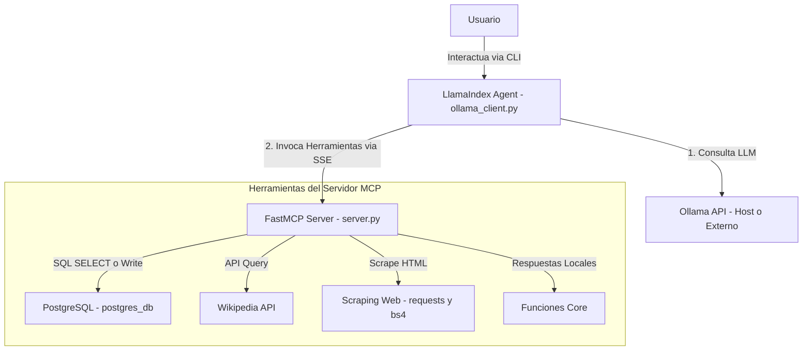

# 🤖 LlamaIndex Agent with Model Context Protocol (MCP) & Ollama

Este repositorio contiene una arquitectura modular para ejecutar un agente inteligente interactivo basado en **LlamaIndex** y **Ollama** (utilizando el modelo `qwen3:32b` u otro de tu elección), el cual interactúa con un servidor de **Model Context Protocol (MCP)** desarrollado con **FastMCP**.

El servidor MCP expone herramientas personalizadas que le permiten al agente consultar bases de datos PostgreSQL, buscar en Wikipedia, extraer contenido de páginas web y ejecutar saludos o poemas de manera dinámica.

---

## 🗺️ Arquitectura del Sistema

El siguiente diagrama detalla cómo interactúan los componentes dentro de la red Docker (`mcp_network`):



---

## 📂 Estructura del Proyecto

```struct
mcp_ollama/
├── db/
│   ├── docker-compose.yaml      # Contenedor de PostgreSQL
│   └── init.sql                 # Esquema de base de datos y datos semilla
├── mcp_prueba/
│   ├── .env                     # Variables de entorno (URL de Ollama)
│   ├── .python-version          # Versión de Python fijada (3.13)
│   ├── Dockerfile               # Configuración de Docker para el Servidor/Cliente
│   ├── docker-compose.yaml      # Orquestador del Servidor MCP y Cliente Agent
│   ├── ollama_client.py         # Cliente interactivo (LlamaIndex Agent)
│   ├── server.py                # Servidor FastMCP con herramientas expuestas
│   ├── pyproject.toml           # Dependencias administradas con UV/Pip
│   └── uv.lock                  # Lockfile de UV
└── README.md                    # Documentación principal
```

---

## 🛠️ Herramientas Expuestas por el Servidor MCP

El servidor FastMCP (`server.py`) expone las siguientes herramientas (`tools`) que el agente consume de forma transparente:

| Herramienta | Argumentos | Descripción |
| :--- | :--- | :--- |
| `greet` | `name: str` | Saluda formalmente a una persona por su nombre. |
| `un_poema_de_amor` | _Ninguno_ | Devuelve un poema de amor corto en formato de texto. |
| `consultar_articulo_wikipedia` | `articulo: str` | Busca un artículo en Wikipedia en español y extrae un resumen conciso de 3 oraciones. |
| `consultar_a_un_sitio` | `url: str`, `metodo: str`, `headers: dict`, `params: dict`, `data: dict` | Realiza una solicitud HTTP (GET/POST), limpia el HTML removiendo scripts/estilos y retorna el texto limpio (máx. 4000 caracteres). |
| `get_users` | `query: str` | Ejecuta consultas SQL de tipo `SELECT` en la base de datos (por defecto `SELECT * FROM users;`). |
| `execute_query` | `query: str` | Ejecuta consultas SQL de escritura (`INSERT`, `UPDATE`, `DELETE`) en la base de datos y retorna el número de filas afectadas. |

---

## 🚀 Guía de Inicio Rápido

Tienes dos opciones para levantar el entorno: usando **Docker (Recomendado)** o ejecutando el código **Localmente**.

### Opción A: Despliegue con Docker (Completo)

Esta opción levanta automáticamente la base de datos PostgreSQL, el servidor MCP y el cliente interactivo en una red compartida.

#### 1. Configurar Variables de Entorno
Crea o edita el archivo [mcp_prueba/.env](file:///C:/Users/joaqu/OneDrive/Documentos/repos-para-readme/mcp_ollama/mcp_prueba/.env) y define la URL donde corre tu servicio de Ollama en el Host de Docker:
```env
OLLAMA_URL="http://host.docker.internal:11434"
```
> [!NOTE]
> Usar `host.docker.internal` permite al contenedor Docker comunicarse con el servicio de Ollama que se está ejecutando en tu sistema operativo local. Asegúrate de tener Ollama activo y con el modelo `qwen3:32b` (o el que desees configurar) ya descargado (`ollama run qwen3:32b`).

#### 2. Levantar la Base de Datos PostgreSQL
Navega a la carpeta de la base de datos y levanta el servicio:
```bash
cd db
docker compose up -d
```
Esto creará una base de datos PostgreSQL en el puerto externo `21001` y ejecutará [init.sql](file:///C:/Users/joaqu/OneDrive/Documentos/repos-para-readme/mcp_ollama/db/init.sql) para crear y poblar la tabla `users`.

#### 3. Construir e Iniciar los Servicios del Agente y MCP
Navega a la carpeta principal de la aplicación `mcp_prueba`, construye la imagen e inicia la red de servicios:
```bash
cd ../mcp_prueba
# 1. Construir la imagen local
docker build -t mcp_prueba .

# 2. Levantar el servidor MCP en segundo plano
docker compose up -d mcp_server

# 3. Ejecutar el Agente interactivo (Cliente) en tu terminal
docker compose run --rm mcp_client
```
Una vez ejecutado el cliente, verás una interfaz interactiva en consola donde puedes chatear con el agente **Jorge**. El agente decidirá automáticamente qué herramienta utilizar para responderte.

---

### Opción B: Ejecución Local (Desarrollo)

Para correrlo localmente sin contenedores para el Agente/Server, asegúrate de tener instalado [uv](https://github.com/astral-sh/uv).

#### 1. Crear y sincronizar el entorno virtual
Dentro de la carpeta `mcp_prueba`:
```bash
# Crear el entorno de desarrollo
uv venv

# Activar el entorno virtual
# En Windows:
.venv\Scripts\activate
# En macOS/Linux:
source .venv/bin/activate

# Sincronizar dependencias
uv sync
```

#### 2. Modificar archivo de cliente (Temporal para local)
En [ollama_client.py](file:///C:/Users/joaqu/OneDrive/Documentos/repos-para-readme/mcp_ollama/mcp_prueba/ollama_client.py), cambia la línea 89 para apuntar a `localhost` en lugar del nombre de servicio de docker:
```python
# Cambiar esto:
# mcp_client = BasicMCPClient("http://mcp_server:21000/sse")
# Por esto:
mcp_client = BasicMCPClient("http://localhost:21000/sse")
```

#### 3. Levantar la base de datos localmente
Asegúrate de mantener levantada la base de datos PostgreSQL mediante Docker, ya que el servidor MCP se conectará a ella:
```bash
cd db
docker compose up -d
```
> Si corres PostgreSQL de forma nativa en tu host, puedes ajustar las credenciales de conexión en [server.py](file:///C:/Users/joaqu/OneDrive/Documentos/repos-para-readme/mcp_ollama/mcp_prueba/server.py#L41-L49).

#### 4. Ejecutar el Servidor y Cliente
Abre dos pestañas de terminal con el entorno virtual activo:

* **Terminal 1: Iniciar Servidor MCP (Modo SSE)**
  ```bash
  cd mcp_prueba
  uv run server.py --server_type=sse
  ```

* **Terminal 2: Iniciar Cliente Agente**
  ```bash
  cd mcp_prueba
  uv run ollama_client.py
  ```

---

## ⚙️ Configuración y Variables de Entorno

### Base de Datos PostgreSQL
Configurada por defecto en `db/docker-compose.yaml`:
* **Host**: `db` (interno en docker) / `localhost` (puerto expuesto `21001`)
* **Base de Datos**: `mcp_database`
* **Usuario / Contraseña**: `admin` / `admin123`

### Variables de entorno del Agente (`mcp_prueba/.env`)
* `OLLAMA_URL`: Dirección de la API de Ollama (ej. `http://localhost:11434` o `http://host.docker.internal:11434`).

---

## 🧠 Flujo de Trabajo del Agente

1. **LlamaIndex FunctionAgent**: El agente inteligente está configurado bajo la clase `FunctionAgent` de LlamaIndex con las herramientas de la especificación MCP.
2. **Model Context Protocol (MCP)**: Las herramientas de Python implementadas en `server.py` se registran a través de FastMCP. La comunicación se realiza a través de **SSE (Server-Sent Events)** sobre HTTP.
3. **Decisión Inteligente**: Cuando le pides al agente algo como *"¿Qué usuarios hay en la base de datos?"* o *"Búscame información sobre la fotosíntesis"*, el LLM genera una llamada a la herramienta adecuada, LlamaIndex resuelve la llamada haciendo una request HTTP al servidor MCP, obtiene la respuesta y el LLM formula la respuesta final para el usuario.
